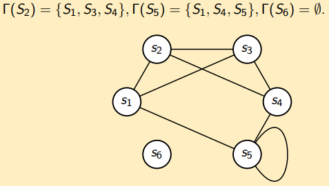
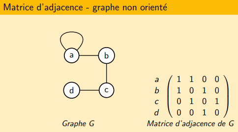
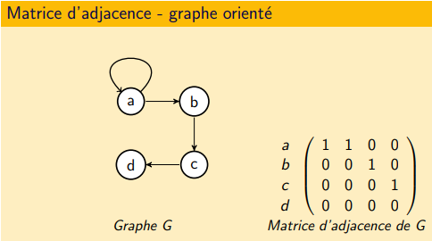
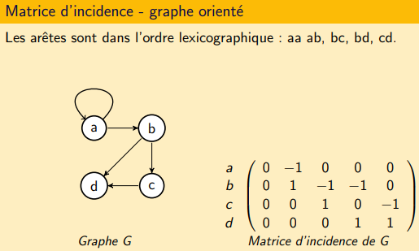

<script type="text/javascript" src="https://cdnjs.cloudflare.com/ajax/libs/mathjax/2.7.7/latest.js?config=TeX-MML-AM_CHTML"></script>  
<link rel="stylesheet" type="text/css" href="https://tikzjax.com/v1/fonts.css">  
<script src="https://tikzjax.com/v1/tikzjax.js"></script>

[Index](./index.md)
[Cours suivant](./cours_2.md)

# Définitions

<script type="text/tikz">
\begin{tikzpicture}
	\tikzstyle{etiquette}=[color=black]
	\tikzstyle{sommet}=[circle, draw=black!50,  thick]

	\node[sommet] (1) at (0,1.5) {$1$};
	\node[sommet] (2) at (3,1.5) {$2$}
		edge node [above, etiquette] {$e_1$} (1);
	\node[sommet] (4) at (6,1.5) {$4$}
		edge node [above, etiquette] {$e_4$} (2);

	\node[sommet] (3) at (1.5,0) {$3$}
		edge node [left, etiquette]  {$e_2$} (1)
		edge node [right, etiquette] {$e_3$} (2);
	\node[sommet] (5) at (4.5,0) {$5$}
		edge node [left, etiquette]  {$e_5$} (2)
		edge node [below, etiquette] {$e_6$} (3)
		edge node [right, etiquette] {$e_7$} (4);
\end{tikzpicture}
</script>

## Graphe Non Orienté
Un **graphe** G est un couple (V, E) où :
* V est un ensemble *non vide* dont les éléments sont appelés **sommets**
* E est un ensemble d'éléments appelés **arêtes**, chaque arête étant composée de deux sommets V

Exemple : G=(V,E) avec V={a,b,c,d,e} et E={e1=ab, e2=ad, e3=bc, e4=ce, e5=ce, e6=dd, e7=de}  

<script type="text/tikz">
\begin{tikzpicture}
	\tikzstyle{etiquette}=[color=black]
	\tikzstyle{sommet}=[circle, draw=black!50,  thick]
	\node[sommet] (A) at (2,4) {a};
	\node[sommet] (B) at (5,6) {b}
		edge node [above, etiquette] {e1} (A);
	\node[sommet] (C) at (8,4) {c}
		edge node [above, etiquette] {e3} (B);
	\node[sommet] (D) at (2,2) {d}
		edge node [left, etiquette] {e2} (A)
		edge[out=-90, in=-180, min distance=10mm] node [left, etiquette] {e6} (D);
	\node[sommet] (E) at (8,2) {e}
		edge[bend right] node [right, etiquette] {e4} (C)
		edge[bend left] node [left, etiquette, bend right] {e5} (C)
		edge node [above, etiquette] {e7} (D);
\end{tikzpicture}
</script>

#### Boucle
Un arête qui relie un sommet à lui-même.

#### Multi-arête
Un ensemble d'arêtes qui relient les deux mêmes sommets.  

Exemple : e6 est une boucle et {e4, e5} est une multi-arête.

#### Graphe Simple
Un **graphe simple** est un graphe sans boucle ni arête multiple.

#### Degré
Le **degré** d'un sommet v dans un graphe G, noté degG(v), est le nombre d'arête lié au sommet.  
Une boucle compte pour 2 arêtes.  


#### Adjacent / Voisin
Deux sommets reliés par une arête sont **voisins** (=**adjacent**).  
L'ensemble des voisins d'un sommet v est appelé le **voisinage** de v.  
Il est noté : $$\Gamma (v)$$  



#### Incidence
Une arête e=uv est **incidente** aux sommets u et v.  
De même, u et v sont **incidents** à e.

#### Ordre
L'**ordre** est le nombre de sommet du graphe. Noté n(G).

#### Taille
La **taille** est le nombre d'arêtes du graphe. Noté m(G).

#### Notations
$$V(G)$$ : Ensemble des sommets  
$$E(G)$$ : Ensemble des arêtes  
$$\Delta (G)$$ : Degré maximum  
$$\delta (G)$$ : Degré minimum

## Graphe Orienté
On ne parle plus d'arêtes mais d'**arcs**. On dessine des flèches au lieu de traits.  

Arc uv reliant le sommet u au sommet v (u⟶v):
- uv est un arc **sortant** de u
- uv est un arc **entrant** de v
- u est un **prédécesseur** de v
- v est un **successeur** de u

#### Degré sortant
Le **degré sortant** est le nombre d'arcs sortant du sommet v.  
Noté : $$d^+(v)$$  

De même : $$\Gamma ^+(v)$$ est l'ensemble des successeurs de v.

#### Degré entrant
Le **degré entrant** est le nombre d'arcs entrant du sommet v.
Noté : $$d^-(v)$$

De même : $$\Gamma ^-(v)$$ est l'ensemble des prédécesseurs de v.

## Étiquetage

#### Étiquette
Une **étiquette** est le nom d'un sommet.  
L'**étiquetage** est l'ensemble des étiquettes d'un graphe.  
Les étiquettes permettent de différencier deux graphes.  
Les deux graphes suivants sont différents

<script type="text/tikz">
\begin{tikzpicture}
	\tikzstyle{sommet}=[circle, draw=black!50,  thick]
	\node[sommet] (A) at (0,2) {$A$};
	\node[sommet] (B) at (2,2) {$B$}
		edge node {} (A);
	\node[sommet] (C) at (2,0) {$C$}
		edge node {} (B);
	\node[sommet] (D) at (0,0) {$D$}
		edge node {} (A)
		edge node {} (C);

	\node[sommet] (AA) at (8,2) {$A$};
	\node[sommet] (CC) at (10,2) {$B$}
		edge node {} (AA);
	\node[sommet] (BB) at (10,0) {$C$}
		edge node {} (CC);
	\node[sommet] (DD) at (8,0) {$D$}
		edge node {} (AA)
		edge node {} (BB);
\end{tikzpicture}
</script>

#### Isomorphisme
Deux graphes sont **isomorphes** s'ils sont égaux à un renommage des sommets près.  
Ils sont isomorphes si ils ont le même nombre de sommets et sont connectés de la même façon.  

## Cheminement (Graphe Non Orienté)

#### Chaîne
Une **chaîne** est une suite alternée de sommets et d'arêtes d'un graphe.  
$$v_1, e_1, v_2, e_2, ..., v_k, e_k, v_{k+1}\ tel\ que\ pour\ tout\ 1 \leq i \leq k, e_i = v_i\times v_{i+1}$$  
La **longueur** d'une chaîne est son nombre d'arêtes.  
Une chaîne est **simple** si elle ne contient pas deux fois la même arête.  
Une chaîne est **élémentaire** si elle ne contient pas deux fois le même sommet.  
*Toute chaîne élémentaire est simple.*

#### Cycle
Un **cycle** est une chaîne dont les extrémités se confondent.  
Sa **longueur** est son nombre d'arêtes (donc également de sommets).  
Un cycle est **élémentaire** si il ne contient pas deux fois le même sommet, à l'exception des extrémités.

*Sauf précision contraire, on parle que de chaîne ou cycle élémentaire.*  
*Une boucle est un cycle.*  
*Dans un graphe simple, on ne précise pas les arêtes de la chaîne ou du cycle.*

## Cheminement (Graphe Orienté)

#### Chemin
Un **chemin** est une suite alternée de sommets et d’arcs d'un graphe.  
$$v_1, e_1, v_2, e_2, ... v_k, e_k, v_{k+1}\ tel\ que\ pour\ tout\ 1 \leq i \leq k, e_i = v_i\times v_{i+1}$$  
La **longueur** d’un chemin est son nombre d’arcs.  
Un chemin est **simple** si il ne contient pas deux fois le même arc.  
Un chemin est **élémentaire** si il ne contient pas deux fois le même sommet.  
*Tout chemin élémentaire est simple.*

#### Circuit
Un **circuit** est un chemin dont les extrémités se confondent.  
Sa **longueur** est son nombre d'arêtes (donc également de sommets).  
Un circuit est **élémentaire** si il ne contient pas deux fois le même sommet, à l'exception des extrémités.

*Sauf précision contraire, on parle que de chemin ou circuit élémentaire.*  
*Une boucle est un circuit.*  
*Dans un graphe simple, on ne précise pas les arêtes du chemin ou du circuit.*
*Si on parle de chaîne ou de cycle dans un graphe orienté, cela signifie que l’on néglige l’orientation des arcs.*

## Sous-graphes

#### Sous-graphe induit
Un sous-graphe en enlevant des sommets.  
Ex : Un sous-graphe où le sommet c est enlevé.  
<script type="text/tikz">
\begin{tikzpicture}
	\tikzstyle{sommet}=[circle, draw=black!50,  thick]
	\node[sommet] (A) at (0,2) {$A$};
	\node[sommet] (B) at (2,2) {$B$}
		edge node {} (A);
	\node[sommet] (C) at (2,0) {$C$}
		edge node {} (A)
		edge node {} (B);
	\node[sommet] (D) at (0,0) {$D$}
		edge node {} (A)
		edge node {} (B)
		edge node {} (C);

	\node[sommet] (AA) at (8,2) {$A$};
	\node[sommet] (BB) at (10,2) {$B$}
		edge node {} (AA);
	\node[sommet] (DD) at (8,0) {$D$}
		edge node {} (AA)
		edge node {} (BB);
\end{tikzpicture}
</script>

#### Sous-graphe partiel
Un sous-graphe en enlevant des arêtes.  
Ex : Un sous-graphe où l'arête a-c est enlevée.  
<script type="text/tikz">
\begin{tikzpicture}
	\tikzstyle{sommet}=[circle, draw=black!50,  thick]
	\node[sommet] (A) at (0,2) {$A$};
	\node[sommet] (B) at (2,2) {$B$}
		edge node {} (A);
	\node[sommet] (C) at (2,0) {$C$}
		edge node {} (A)
		edge node {} (B);
	\node[sommet] (D) at (0,0) {$D$}
		edge node {} (A)
		edge node {} (B)
		edge node {} (C);

	\node[sommet] (AA) at (8,2) {$A$};
	\node[sommet] (BB) at (10,2) {$B$}
		edge node {} (AA);
	\node[sommet] (CC) at (10,0) {$C$}
		edge node {} (BB);
	\node[sommet] (DD) at (8,0) {$D$}
		edge node {} (AA)
		edge node {} (BB)
		edge node {} (CC);
\end{tikzpicture}
</script>

## Connexité

#### Graphe Connexe
Un graphe est **connexe** si et seulement si il existe une chaîne entre toute paire de sommets.

#### Graphe Fortement Connexe
Un graphe est **fortement connexe** si et seulement si il existe un chemin entre toute paire de sommets.

#### Composante Connexe
Une **composante connexe** est un sous-graphe induit maximal qui est connexe.

#### Composante Fortement Connexe
Une **composante fortement connexe** est un sous-graphe induit maximal qui est fortement connexe.

#### Graphe K-Connexe
Un graphe est **k-connexe** si toute suppression d'au plus k-1 sommet ne déconnecte pas le graphe.  
Ex : Un graphe est 2-connexe si on supprime 1 sommet et qu'il est toujours connexe.  

#### Connectivité
La **connectivité** d'un graphe est le plus grand entier k tel que le graphe est k-connexe.

#### Graphe complet
Graphe dont tout les sommets sont reliés ensemble.


## Représentation des graphes

#### Matrice d'adjacence
Matrice n*n (graphe à n sommets) qui contient le nombre d'arêtes/arcs entre les sommets du graphe





#### Matrice d'incidence
Matrice n*m (graphe à n sommets et m arêtes/arcs) qui contient le nombre d'incidence entre le sommet et l'arête/arc.  

Graphe non orienté :
- 2 si boucle
- 1 si arête
- 0 sinon

Graphe orienté :
- -1 si origine arc
- 1 si destination arc
- 0 si boucle ou pas incident




#### Liste d'adjacence
Un graphe peux être représenté par la liste d'adjacence de ses sommets.  
Dans un graphe non orienté : liste d'ensemble des voisins.  
Dans un graphe orienté : liste des successeurs.

## Théorèmes
```
Le nombre maximum d’arêtes dans un graphe simple est égal à
n(n−1)/2
```
```
La somme des degrés d'un graphe non orienté est paire et égale à
deux fois le nombre d'arêtes.
```
```
Le nombre de sommets de degré impair dans un graphe non orienté est pair.
```
```
Dans un graphe orienté, la somme des degré entrants est égale à
la somme des degrés sortants et au nombre d'arcs.
```
```
Dans tout graphe simple ayant au moins deux sommets,
il existe au moins deux sommets de même degré.
```

[Index](./index.md)
[Cours suivant](./cours_2.md)
