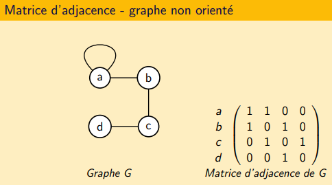
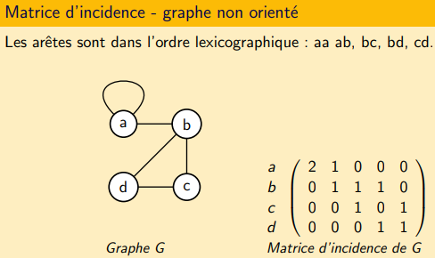

<script type="text/javascript" src="https://cdnjs.cloudflare.com/ajax/libs/mathjax/2.7.7/latest.js?config=TeX-MML-AM_CHTML"></script>  
<link rel="stylesheet" type="text/css" href="https://tikzjax.com/v1/fonts.css">  
<script src="https://tikzjax.com/v1/tikzjax.js"></script>

[Index](./index.md)

# Définitions

<script type="text/tikz">
\begin{tikzpicture}

\tikzstyle{NormalVertexStyle}=[shape        = circle,
                                  minimum size = 8pt,%
                                  draw]
\Vertex[L=$s_0$             ]{S}
\Vertex[x=-2, y=0,    L=$s_1$]{A}
\Vertex[x=-1.2, y=1.4,    L=$s_2$]{B}
\Vertex[x=1.2, y=1.4,    L=$s_3$]{C}
\Vertex[x=2, y=0,    L=$s_4$]{D}
\Vertex[x=-1.2, y=-1.4,  L=$s_6$]{E}
\Vertex[x=1.2, y=-1.4,  L=$s_5$]{F}

\Edge(B)(D)
 \Edge(A)(B)
 \Edge(A)(C)
 \Edge(S)(E)
 \Edge(A)(F)
 \Edge(B)(D)
 \Edge(B)(C)
 \Edge(C)(D)
\end{tikzpicture}
</script>

## Graphe Non Orienté
Un **graphe** G est un couple (V, E) où :
* V est un ensemble *non vide* dont les éléments sont appelés **sommets**
* E est un ensemble d'éléments appelés **arêtes**, chaque arête étant composée de deux sommets V


#### Boucle
Un arête qui relie un sommet à lui-même.

#### Multi-arête
Un ensemble d'arêtes qui relient les deux mêmes sommets.

  

#### Graphe Simple
Un **graphe simple** est un graphe sans boucle ni arête multiple.

#### Degré
Le **degré** d'un sommet v dans un graphe G, noté degG(v), est le nombre d'arête lié au sommet.  
Une boucle compte pour 2 arêtes.  


#### Adjacent / Voisin
Deux sommets reliés par une arête sont **voisins** (=**adjacent**).  
L'ensemble des voisins d'un sommet v est appelé le **voisinage** de v.  
Il est noté : Γ(v)  


#### Incidence
Une arête e=uv est **incidente** aux sommets u et v.  
De même, u et v sont **incidents** à e.

#### Ordre
L'**ordre** est le nombre de sommet du graphe. Noté n(G).

#### Taille
La **taille** est le nombre d'arêtes du graphe. Noté m(G).

#### Notations
V(G) : Ensemble des sommets  
E(G) : Ensemble des arêtes  
Δ(G) : Degré maximum  
ẟ(G) : Degré minimum

## Graphe Orienté
On ne parle plus d'arêtes mais d'**arcs**. On dessine des flèches au lieu de traits.  

Arc uv reliant le sommet u au sommet v (u⟶v):
- uv est un arc **sortant** de u
- uv est un arc **entrant** de v
- u est un **prédécesseur** de v
- v est un **successeur** de u

#### Degré sortant
Le **degré sortant** est le nombre d'arcs sortant du sommet v.  
Noté : d⁺(v)  

De même : Γ⁺(v) est l'ensemble des successeurs de v.

#### Degré entrant
Le **degré entrant** est le nombre d'arcs entrant du sommet v.
Noté : d⁻(v)

De même : Γ⁻(v) est l'ensemble des prédécesseurs de v.

## Étiquetage

#### Étiquette
Une **étiquette** est le nom d'un sommet.  
L'**étiquetage** est l'ensemble des étiquettes d'un graphe.  
Les étiquettes permettent de différencier deux graphes.
```a
a-b                    a-c
| |  est différent de  | |
d-c                    d-b
```

#### Isomorphisme
Deux graphes sont **isomorphes** s'ils sont égaux à un renommage des sommets près.  
Ils sont isomorphes si ils ont le même nombre de sommets et sont connectés de la même façon.  

## Cheminement (Graphe Non Orienté)

#### Chaîne
Une **chaîne** est une suite alternée de sommets et d'arêtes d'un graphe.  
`v1, e1, v2, e2, v3, ..., vk, ek, vk+1 tel que pour tout 1 ≤ i ≤ k, ei = vi vi+1`  
La **longueur** d'une chaîne est son nombre d'arêtes.  
Une chaîne est **simple** si elle ne contient pas deux fois la même arête.  
Une chaîne est **élémentaire** si elle ne contient pas deux fois le même sommet.  
*Toute chaîne élémentaire est simple.*

#### Cycle
Un **cycle** est une chaîne dont les extrémités se confondent.  
Sa **longueur** est son nombre d'arêtes (donc également de sommets).  
Un cycle est **élémentaire** si il ne contient pas deux fois le même sommet, à l'exception des extrémités.

*Sauf précision contraire, on parle que de chaîne ou cycle élémentaire.*  
*Une boucle est un cycle.*  
*Dans un graphe simple, on ne précise pas les arêtes de la chaîne ou du cycle.*

## Cheminement (Graphe Orienté)

#### Chemin
Un **chemin** est une suite alternée de sommets et d’arcs d'un graphe.  
`v1, e1, v2, e2, v3, ... vk, ek, vk+1 tel que pour tout 1 ≤ i ≤ k, ei = vi vi+1`  
La **longueur** d’un chemin est son nombre d’arcs.  
Un chemin est **simple** si il ne contient pas deux fois le même arc.  
Un chemin est **élémentaire** si il ne contient pas deux fois le même sommet.  
*Tout chemin élémentaire est simple.*

#### Circuit
Un **circuit** est un chemin dont les extrémités se confondent.  
Sa **longueur** est son nombre d'arêtes (donc également de sommets).  
Un circuit est **élémentaire** si il ne contient pas deux fois le même sommet, à l'exception des extrémités.

*Sauf précision contraire, on parle que de chemin ou circuit élémentaire.*  
*Une boucle est un circuit.*  
*Dans un graphe simple, on ne précise pas les arêtes du chemin ou du circuit.*
*Si on parle de chaîne ou de cycle dans un graphe orienté, cela signifie que l’on néglige l’orientation des arcs.*

## Sous-graphes

#### Sous-graphe induit
Un sous-graphe en enlevant des sommets.  
```a
a---b                   a---b
|\ /|                   |  /
| ╳ |  a un sous-graphe | /    (le sommet d est enlevé)
|/ \|                   |/
c---d                   c
```

#### Sous-graphe partiel
Un sous-graphe en enlevant des arêtes.  
```a
a---b                   a---b
|\ /|                   |  /|
| ╳ |  a un sous-graphe | / |  (l'arête ad est enlevée)
|/ \|                   |/  |
c---d                   c---d
```

## Connexité

#### Graphe Connexe
Un graphe est **connexe** si et seulement si il existe une chaîne entre toute paire de sommets.

#### Graphe Fortement Connexe
Un graphe est **fortement connexe** si et seulement si il existe un chemin entre toute paire de sommets.

#### Composante Connexe
Une **composante connexe** est un sous-graphe induit maximal qui est connexe.

#### Composante Fortement Connexe
Une **composante fortement connexe** est un sous-graphe induit maximal qui est fortement connexe.

#### Graphe K-Connexe
Un graphe est **k-connexe** si toute suppression d'au plus k-1 sommet ne déconnecte pas le graphe.  
Ex : Un graphe est 2-connexe si on supprime 1 sommet et qu'il est toujours connexe.  

#### Connectivité
La **connectivité** d'un graphe est le plus grand entier k tel que le graphe est k-connexe.

#### Graphe complet
Graphe dont tout les sommets sont reliés ensemble.


## Représentation des graphes

#### Matrice d'adjacence
Matrice n*n (graphe à n sommets) qui contient le nombre d'arêtes/arcs entre les sommets du graphe




#### Matrice d'incidence
Matrice n*m (graphe à n sommets et m arêtes/arcs) qui contient le nombre d'incidence entre le sommet et l'arête/arc.  

Graphe non orienté :
- 2 si boucle
- 1 si arête
- 0 sinon

Graphe orienté :
- -1 si origine arc
- 1 si destination arc
- 0 si boucle ou pas incident




#### Liste d'adjacence
Un graphe peux être représenté par la liste d'adjacence de ses sommets.  
Dans un graphe non orienté : liste d'ensemble des voisins.  
Dans un graphe orienté : liste des successeurs.

## Théorèmes
```a
Le nombre maximum d’arêtes dans un graphe simple est égal à
n(n−1)/2
```
```a
La somme des degrés d'un graphe non orienté est paire et égale à
deux fois le nombre d'arêtes.
```
```a
Le nombre de sommets de degré impair dans un graphe non orienté est pair.
```
```a
Dans un graphe orienté, la somme des degré entrants est égale à
la somme des degrés sortants et au nombre d'arcs.
```
```a
Dans tout graphe simple ayant au moins deux sommets,
il existe au moins deux sommets de même degré.
```

[Index](./index.md)
